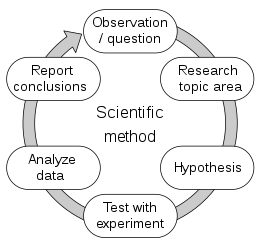

## The Problem

I was in the process of destroying my room to find a webcam mount when I asked myself the simple question:
*How many Tide Pods do I have left?*

This is an important question considering my laundry day is upcoming and I don't want to go shopping in this weather or spend money.

This then raised the question:
*Do I have money for Tide Pods?*

Causing me to then ask:
*How much money have I spent on Tide Pods?*

And as I looked down the mountain of time that I have climbed and looked into the heaven of what is to come (if only I wrote this back in my high school English classes) I asked in fear:
*How much money **will** I spend on Tide Pods?*

## The Scientific Method

I'm not going to lie, this is just an excuse to practice the [Scientific Method](https://en.wikipedia.org/wiki/Scientific_method) and to get better at blogging as it is one of my goals for 2022 (but we can see how well that has been going).

The [Scientific Method](https://en.wikipedia.org/wiki/Scientific_method) is something that I learned back in middle school and have forgotten about until I started working on this problem. It is a cyclical pattern where the input is an **[Observation/Question](#observationquestion)**, followed by **[Research into the Topic Area](#research-into-the-topic-area)**, then a **Hypothesis** as to what the solution/outcome of an experiment will be, then **Testing the Hypothesis with an Experiment**, followed by an **Analysis of the Experimental Data**, then a **Report**, and restarting the cycle with **Observation/Question** as we started.



> Source: [Wikipedia's *The Scientific Method* Article](https://en.wikipedia.org/wiki/Scientific_method#/media/File:The_Scientific_Method.svg)

So in the spirit of The Scientific Method and getting started, here is my attempt at making my middle school science teachers proud.

### Observation/Question

As stated above in [The Problem](#the-problem), I am trying to figure out:

* How much money I have already spent on Tide Pods
* How much money I am going to spend on Tide Pods in the future

These can be written as the following research questions:

**RQ1**: How much money have I spent on Tide Pods?

**RQ2**: How much money will I spend on Tide Pods?

### Research into the Topic Area

To research this I first started by exploring what's a Tide Pod their history.

#### Who Created Tide Pods?

In my brief research, I didn't find a specific individual who created the "Tide Pod".

The [Tide](https://tide.com/en-us) company is owned by [Proctor & Gamble](https://us.pg.com/brands/#Fabric-Care). So "[Tide Pods](https://tide.com/en-us/shop/type/laundry-pods)" as a product are marketed and sold by the [Tide](https://tide.com/en-us) company, however, [Proctor & Gamble](https://us.pg.com/brands/#Fabric-Care) have a stake in the success of the product (being the parent company and all).

#### What is a Tide Pod?

A "Tide Pod" is generically called a [laundry detergent pod](https://en.wikipedia.org/wiki/Laundry_detergent_pod). These pods have been around since the '60s, but more on that later.

These pods contain concentrated detergent and other cleaning chemicals used to treat dirty laundry contained within a water-soluble casing.

> Source: [Tide's *How to Use Tide Pods* Guide](https://tide.com/en-us/our-commitment/americas-number-one-detergent/our-products/laundry-pacs/how-to-use-tide-pods).

You simply throw one of the pods into your laundry machine, load in the laundry on top of it, and then start your wash cycle. Due to your washing machine drum's centrifugal force and the water that is sloshed around, the casing dissolves releasing the cleaning chemicals into the surrounding water and clothes. This results in your clothes being spun around in a diluted solution of water and cleaning chemicals.

#### The Brief History

Turns out this isn't the first time that Proctor & Gamble have tried their hand at laundry detergent pods.

Back in the '60s, they released a product called "Salvo" tablets. These operate in the same manner as Tide Pods in that they are a mechanism to deliver concentrated detergent into a washing machine as a solid form. However, they were dry tablets that contained essentially detergent dust shaped into a hockey puck. They were discontinued in 1978 because they didn't sometimes fully dissolve, causing chunks of it to be left on clothes and at the bottom of laundry drums.

But in Europe, laundry tablets took off in 1998 under the Unilever company under the name "Persil". Proctor & Gamble responded by releasing laundry tablets in Europe the following year. However, "Persil" didn't do well in America [because they didn't dissolve well in American washers](https://en.wikipedia.org/wiki/Laundry_detergent_pod#History), just like the "Salvo" tablets.

```text
Total Side Note:

Turns out that there is a sizable difference between US and EU washing machines.

Searching for EU washing machines results in front-loading machines. While searching for US washing machines results in top-loading machines.

This is important because if we assume that all US households had top-loaders and all EU households had front-loaded washing machines up to 1998, then Salvo failed in the US because the drum that spins the laundry and the tablet spun on the wrong axis.

If I had enough money and time, I would test if this theory is clean.

Here's the hypothesis, Venmo me later:

Salvo tablets will not fully dissolve in the washing machine drum spins on the Y-axis.
```

> Source: [The New York Times](https://www.nytimes.com/2000/08/25/business/media-business-advertising-unilever-procter-gamble-line-up-campaigns-for-new.html)

It wasn't until 2012 that Tide released the first liquid laundry detergent pod known as "Tide Pods".

> Source: [Proctor & Gamble Press Release](https://news.pg.com/news-releases/news-details/2012/Tide-Puts-a-Spin-on-Laundry-with-the-Introduction-of-Tide-Pods/default.aspx)

Currently (January 31st, 2022) the top-rated Tide Pod product on Amazon.com goes for $23.99, contains 96 individual Tide Pods per container, and does triple duty as a detergent, stain remover, and color protector.

> Source: [Amazon.com](https://www.amazon.com/Tide-Liquid-Laundry-Detergent-Packaging/dp/B07JMHCFF8/ref=sr_1_1?keywords=tide+pods&sr=8-1)

### The Hypothesis

After all of that research (which took way longer than expected), I think I can come up with a pretty good hypothesis for each of the three research questions.

**RQ1**: How much money have I spent on Tide Pods?

**H1**: I have spent $110 on Tide Pods from March 2012 to January 2022.

**RQ2**: How much money will I spend on Tide Pods?

**H2**: I will spend an additional $920 on Tide Pods before I die.

These hypotheses:

* Ignore that I relied on my parents from 2012 to 2018 to provide Tide Pods to clean my laundry
* Assume I will die once I turn 80
* That I have bought Tide Pods since day one and I will continue to do so as a loyal fanboy
* I've only and will continue to only purchase [these exact Tide Pods](https://www.amazon.com/Tide-Liquid-Laundry-Detergent-Packaging/dp/B07JMHCFF8/ref=sr_1_1?keywords=tide+pods&sr=8-1)
* The price of Tide Pods will not and have not fluctuated or changed in any manner
* I bought these Tide Pods without any deals or discounts
* Taxes are not included

### The Experiment

Luckily, the experiment to test these hypotheses is fairly simple. Pull out a calculator and start crunching numbers.

My calculator of choice is going to be the [GNU Basic Calculator](https://www.gnu.org/software/bc/) also known as `bc`.

Why? Because I saw it in my installed software and wanted to try it.

#### Calculating How Much I've Already Spent

I am currently 21 years and 9 months old.

There are 52 weeks in a year.

Converted into weeks, I am currently 9 months and 1092 weeks old.

```bc
52 * 21
1092
```

Assuming that every month consists of 4 weeks, I am currently 1128 weeks old

```bc
4 * 9 + 1092
1128
```

Tide Pods weren't released until March of 2012. Assuming that Tide Pods became immediately available the first week of March 2012, Tide Pods **did not** exist for 12 years and two months of my life.

In other words, Tide Pods did not exist for the first 632 weeks of my life.

```bc
12 * 52 + 4 * 2
632
```

This means that Tide Pods have existed for only 496 weeks of my life.

```bc
1128 - 632
496
```

Based on my habits, I typically use 2 Tide Pods from October to March because I wear hoodies and other heavier clothes that I don't feel comfortable putting together as one large load of laundry.

This means that for 6 months (26 weeks), I use 2 Tide Pods a week. For the other 6 months, I only use 1 Tide Pod

```bc
52 / 2
26
```

To calculate the number of Tide Pods used I'm going to divide 496 by 2, then add that to 496. The proof goes as the following:

**Case 1**: I use 1 Tide Pod for 26 weeks of the year.

Since 26 is half of 52 (the number of weeks in a year), and I only use 1 Tide Pod during that time I can do the following:

* `\# of Weeks` *`\# of Tide Pods` -> 26* 1 = 26

Expanding this to my lifetime, I have been alive for 496 weeks. Therefore,

* `\# of Weeks` = 496 / 2.

The equation then becomes:

* (496 / 2) * 1 = 248

```bc
(496 / 2) * 1
248
```

**Case 2**: I use 2 Tide Pods for 26 weeks of the year.

This case follows the same logic as **Case 1**, except:

* `\# of Tide Pods` = 2

The equation then becomes:

* (496 / 2) *2 =*x*

But the equation can be rewritten as:

* 496 *(1/2)* 2 = *x*

Solving for *x* = 496

In other words, I have used 496 Tide Pods during my life in **Case 2**.

##### Calculating the Cost of How Many Tide Pods I've used

Summing the solutions from **Case 1** and **Case 2** I get that I have used **744** Tide Pods in my current lifetime.

With the current price of 96 Tide Pods per container being $23.99, the unit price per Tide Pod is...

Well shit, I can't get `bc` to calculate this by itself. To do that I need to enable the `-l` flag as referenced by [this StackOverflow post](https://unix.stackexchange.com/a/66768).

After enabling it, the unit price per Tide Pod is $0.25.

```bc
23.99 / 96
.24989583333333333333
```

##### Result

Now to get the total amount that I have spent on Tide Pods, I calculate:

* `Unit price` *`\# of Tide Pods` -> $0.25* 744 = $186.00

```bc
0.25 * 744
186.00
```

I have spent $186.00 on Tide Pods up until today.

#### Calculating How Much I Will Spend

I'm assuming that I will drop dead on my birthday at 80 years old.

In other words, I will die once I've turned 4160 weeks old.

```bc
80 * 52
4160
```

If I've been around for 1092 years, I can subtract that from my estimated age of death.

In other words, I only have 3068 weeks to keep using glorious Tide Pods.

```bc
4160 - 1092
3068
```

> I want a hug after calculating that...

Following the same logic as **Case 1** and **Case 2** from [above](#calculating-how-much-ive-already-spent), I will use 4602 Tide Pods before I die

```bc
(3068 / 2) + 3068
4602
```

Therefore, the cost of using a future count of 4602 Tide Pods is $1150.50

```bc
4602 * 0.25
1150.50
```

### Analyzing the Data

I have already spent $186.00 on Tide Pods and will spend $1150.50 on Tide Pods throughout my lifetime.

I'm honestly shocked. When I asked this question I was expecting a much larger answer.

Compared to my hypothesis, I'm not far off.

For **H1**, I said, "I have spent $110 on Tide Pods from March 2012 to January 2022,". Doing the math, I was 40.86% off.

```bc
1 - (110 / 186)
.40860215053763440861
```

For **H2**, I said, "I will spend an additional $920 on Tide Pods before I die,". Doing the math, I was 20.035% off.

```bc
1 - (920 / 1150.50)
.20034767492394611039
```

### Report

These percentages make sense to me, but what doesn't is both how few Tide Pods I will use for the remainder of my life, and the cost at which they will cost (if bought at the unit price today). Don't get me wrong, over 4500 Tide Pods is a lot, but I feel like I can put them in a big enough box or two and just store them in a closet (assuming they don't go bad).

The only downside to this is that every time I pull one or two out to do laundry, I can measure how much longer I estimated myself to survive... Yeah, that's kinda dark.

Moving on though, the cost of over 4500 Tide Pods isn't unreasonable. For only $1150.50, you can get a lifetime supply of laundry detergent. Now $1150.50 is nothing to sneeze at, but think about it like this:

If you want a new GPU at scalper prices right now in 2022, you would gladly pay that median price. But if you take that money and spend it on laundry detergent, you can use it to have your clothes smell great and attract mates.

I know that situation doesn't work for everyone. And it shouldn't and isn't meant to. I think that purchasing over $1000 worth of detergent is both a waste of money and space. Quite honestly, this entire thought experiment has been as well.

But to look on the bright side and to conclude this ridiculous article, you got to read a research paper masquerading as a stupid blog post. Cite me in your next paper.
